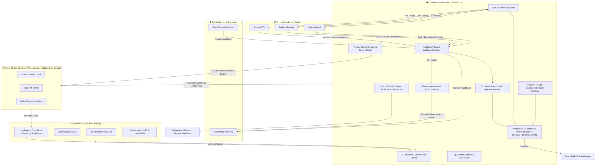

# Conduit
[](https://github.com/booksarestillbetter/conduit/actions/workflows/rust.yml)
[](CHANGELOG.md)
[](LICENSE)

**A unified, multi-node fetcher control plane (Synapse, Transmission, qBittorrent, Deluge) and Sonarr/Radarr/Lidarr/Plex media lifecycle automation daemon — written in Rust, with a React + Tailwind web UI.**

Conduit sits in front of your entire download and media stack — every fetcher node (Synapse, Transmission, qBittorrent, Deluge), every Sonarr/Radarr/Lidarr instance, Plex, and Ombi — and gives you one dashboard, one API, and one set of automation rules across all of it. It replaces a pile of shell scripts, cron jobs, and single-purpose dashboards (transgui, a Sonarr "connect" webhook here, a cron-triggered rsync there) with one always-on Rust daemon that watches everything and reacts in real time.

---

## Why Conduit?

| | **Conduit** | **transgui** | **Sonarr/Radarr alone** |
|---|---|---|---|
| Multi-daemon fetcher control | ✅ Unlimited nodes across Synapse, Transmission, qBittorrent, Deluge | ✅ (Transmission only) | ❌ |
| Cross-node compound torrent IDs (`node:hash`) | ✅ | ❌ (one server at a time) | ❌ |
| Arr-aware enrichment (poster, quality, release match) | ✅ One-click, pulls from Sonarr/Radarr | ❌ | N/A |
| 4-tier media classification & queue routing | ✅ Tracker rules → regex → node overrides | ❌ | Partial (per-instance only) |
| Tracker circuit breaker & swarm pressure relief | ✅ Automatic canary-probe recovery | ❌ | ❌ |
| Sonarr/Radarr/Lidarr/Plex/Ombi webhook ingestion | ✅ One inbound hub, dog-themed rich cards | ❌ | Each app notifies independently |
| Plex "scan this folder" notification | ✅ Conduit triggers it directly (OAuth-linked) | ❌ | ✅ (built into each app separately) |
| Real-time push (WebSocket) | ✅ Torrents, pipeline, events, platform health | ❌ (polls) | ❌ |
| Background task/engine health visibility | ✅ "Platform Health" panel | ❌ | ❌ |
| Runs headless as a daemon | ✅ Single static binary + Docker image | ❌ (desktop GUI client) | ✅ |

transgui is a desktop client for *one* Transmission server. Conduit is the thing that runs 24/7 on your server, watches *all* of your fetcher nodes and Arr instances together, and automates the parts of the pipeline that would otherwise need a human (or a fragile cron job) watching them.

---

## 🌟 Architecture



---

### ⚡ 1. Unified Multi-Node Fetcher Control
- **Cluster Control Plane**: Manages multiple fetcher instances concurrently (e.g. Synapse, Transmission, qBittorrent, Deluge across general, 4K, or remote seedboxes).
- **Compound Torrent IDs (`"{node}:{id}"`)**: Cluster-wide search, filtering by node/tracker/status, and bulk start, pause, delete, and location changes.
- **Deep Torrent Inspector**: horizontal scrolling lifecycle timeline, per-file progress and priorities, live peer telemetry with encryption badges, tracker swarm health, and real-time SVG bandwidth curves.
- **✨ Enrich from Arr**: One-click lookup against Sonarr/Radarr/Lidarr to upgrade a manually-added torrent with posters, quality, and TMDb/TVDb/MusicBrainz IDs.

### ⚡ 2. Tracker Circuit Breaker & Swarm Pressure Relief
Detects tracker-level failure patterns (`530`, `502/503/504`, `403`, `429`, connection refused, timeouts), designates a single canary probe torrent, pauses everything else on that tracker to stop hammering it, and auto-resumes the whole set the moment the canary succeeds again — with a notification either way.

### 🗂️ 3. 4-Tier Media Classification & Queue Routing
On every completed torrent: **(1)** exact match against active Sonarr/Radarr/Lidarr grabs, **(2)** tracker-domain-to-media-type rules, **(3)** filename regex and UHD markers, **(4)** per-node destination overrides. The resulting staging command is read live from the classification response on every run — change it in Settings and every node picks it up immediately, no script redeploy needed.

### 🐕 4. Conduit's Scent Trail & Pipeline Browser
A dedicated view of everything moving through the pipeline — poster art, clean titles, quality tags, and status badges (`🦴 Sniffed` → `🐾 Fetching` → `🎾 Staged` → `🏆 Retrieved`) — updated live over WebSocket, not by polling.

### 🔌 5. Full Webhook Ingestion — Sonarr, Radarr, Lidarr, Plex, Ombi
Every event type each app can send is understood and routed to a purpose-built handler (not just "grab" and "import"): health checks, application updates, manual-interaction-required alerts, library add/delete, renames, batch season-pack imports, Ombi requests and issue tickets, and Plex scrobbles. See [`docs/webhook_reference.md`](docs/webhook_reference.md) for the full field-level reference, sourced directly from each project's own code.

### 🎬 6. Plex Notify-Takeover (OAuth-Linked)
Link your Plex account once via the same PIN-based device-linking flow Ombi uses (no more copying `X-Plex-Token` out of a browser network tab) — Conduit discovers your owned servers automatically. From then on, Conduit itself tells Plex to rescan just the affected show or movie folder the moment Sonarr/Radarr reports an import, replacing the need for Sonarr/Radarr's own built-in Plex connections. Supports multiple Plex servers out of the box.

### 📊 7. Live Telemetry & Real-Time WebSocket Channels
Beyond REST polling, Conduit pushes updates over a single WebSocket connection: torrent/cluster stats every second, and dedicated channels for pipeline changes, the audit log, Arr ecosystem stats, and background-engine health — published the instant something changes, not on a fixed timer.

### 🩺 8. Platform Health — Background Engine Visibility
Every background engine (the fetcher poller, space manager, circuit breaker, file sync, Arr sync, watch-history sync, Arr stats poller, and more) reports its live state, last heartbeat, and restart count. A panicking engine is automatically restarted with backoff — and you can see it happen, instead of it failing silently.

### 🗺️ 9. Space Management & Auto-Purge
Per-node free-space thresholds (never aggregated across nodes) trigger automatic cleanup of well-seeded, sufficiently-aged torrents — configurable ratio/age/seeder-count criteria, largest-reclaim-first, stopping as soon as the deficit clears.

### 🔒 10. Enterprise Security
2FA (TOTP/RFC 6238) with QR setup, Argon2id password hashing, JWT sessions, SQLCipher 256-bit AES-GCM full-database encryption with live passphrase rekeying, scoped API tokens, and encrypted AES-256-GCM configuration backups.

---

## 📡 Supported Daemons & Integrations

| Component | Status |
|---|---|
| **Synapse** | ✅ Fully supported — high-speed gRPC streaming delta driver (`synapse.v2`) |
| **Transmission** | ✅ Fully supported — JSON-RPC 2.0 driver (`/transmission/rpc`) |
| **qBittorrent** | ✅ Fully supported — Web API v2.x driver with cookie session pooling |
| **Deluge** | ✅ Fully supported — Web JSON-RPC driver with cookie session pooling |
| **Sonarr** | ✅ Full webhook ingestion, live telemetry, primary/replica sync, re-search triggering |
| **Radarr** | ✅ Full webhook ingestion, live telemetry, primary/replica sync, re-search triggering |
| **Lidarr** | ✅ Full webhook ingestion, live telemetry, primary/replica sync |
| **Plex** | ✅ OAuth account linking, multi-server support, scrobble ingestion, notify-takeover |
| **Ombi** | ✅ Request/issue webhook ingestion with dog-themed lifecycle notifications |
| **Trakt** | ✅ Watch-history sync from Plex scrobbles, with optional multi-server watch-status backup/sync using Trakt as the hub |
| **Mattermost / Discord / Generic Webhooks** | ✅ Rich card notifications for every lifecycle event |
| **Prometheus** | ✅ `/metrics` scrape endpoint |
| **InfluxDB v2** | ✅ Cluster telemetry line-protocol pusher |

**Multi-tenant "zones"** (0.8.0+): run fully independent stacks side by side — e.g. a general library and a separate 4K library, each with its own Sonarr/Radarr/Lidarr instance and a subset of your Plex servers and fetcher nodes — with both a combined view and a per-zone view (sidebar switcher, zone-scoped webhook URLs, per-zone grab history, per-zone live Sonarr/Radarr telemetry). Purely opt-in: with no zones configured, Conduit behaves exactly as a single-instance setup.

---

## 🚀 Quick Start with Docker

### `docker-compose.yml`
```yaml
services:
  conduit:
    image: conduit:latest
    build: .
    container_name: conduit
    restart: unless-stopped
    ports:
      - "4242:4242"
    volumes:
      - ./data:/data
      - /mnt/storage/downloads:/downloads
      - /mnt/storage/media:/media
    environment:
      - CONDUIT_CONFIG=/data/config.json
      - CONDUIT_DB=/data/db.sqlite
      - CONDUIT_PORT=4242
```

Run:
```bash
docker compose up -d
```
Access the web UI at `http://localhost:4242`.

---

## 🛠️ Local Development

### Requirements
- **Rust** 1.80+
- **Node.js** 20+ and `npm`

```bash
# 1. Build React Web Interface
cd web
npm install
npm run build
cd ..

# 2. Run Backend Daemon
cargo run -- --port 4242

# 3. Run Automated Tests
cargo test
```

---

## 🔌 Fetcher Intake Hook Integration (`copy2queue.py`)

Download your pre-configured intake hook script directly from Conduit:
```bash
# Download Python hook
curl -s http://localhost:4242/api/sync/hook-script?format=py -o /usr/local/bin/copy2queue.py
chmod +x /usr/local/bin/copy2queue.py
```

For Transmission's `settings.json`:
```json
"script-torrent-done-enabled": true,
"script-torrent-done-filename": "/usr/local/bin/copy2queue.py"
```

The script queries Conduit's classification API on every completed download and executes whatever staging command is currently configured — falling back to sensible local heuristics if Conduit is temporarily unreachable, so downloads never get stuck waiting on the daemon.

---

## 📡 API Reference & OpenAPI 3.0 Documentation

Interactive Swagger documentation is available at **`http://localhost:4242/swagger-ui`** and the raw OpenAPI 3.0 specification at **`http://localhost:4242/api-docs/openapi.json`** — every REST endpoint is documented there, including request/response schemas and error conditions. A real-time WebSocket stream is also available at **`/api/ws`** (ticket-authenticated; see the Swagger entry for the full subscribe/channel protocol).

### Summary of REST Endpoints

| Category | Method | Path | Description |
|---|---|---|---|
| **Auth** | `GET` | `/api/auth/setup-status` | Check if initial setup is needed |
| | `POST` | `/api/auth/setup` | Complete first-run setup wizard |
| | `POST` | `/api/auth/login` | User login (with optional 2FA code) |
| | `POST` | `/api/auth/logout` | Invalidate session |
| | `GET` | `/api/auth/me` | Current authenticated user profile |
| | `POST` | `/api/auth/profile` | Update username |
| | `POST` | `/api/auth/change-password` | Update password |
| | `POST` | `/api/auth/2fa/setup` | Generate 2FA TOTP secret & QR Code |
| | `POST` | `/api/auth/2fa/verify` | Verify code and activate 2FA |
| | `POST` | `/api/auth/2fa/disable` | Disable 2FA |
| | `GET`/`POST` | `/api/auth/tokens` | List and create scoped API tokens |
| | `DELETE` | `/api/auth/tokens/{id}` | Revoke API token |
| | `POST` | `/api/auth/ws-ticket` | Issue a single-use WebSocket auth ticket |
| | `POST` | `/api/auth/mobile/pair-token` / `/pair` | Mobile app QR pairing |
| **Torrents** | `GET` | `/api/torrents` | List unified torrents across all nodes |
| | `POST` | `/api/torrents` | Add torrent (magnet, URL, file payload) |
| | `GET` | `/api/torrents/stats` | Global cluster aggregate stats & speed |
| | `GET` | `/api/torrents/{compound_id}` | Detailed torrent telemetry & timeline |
| | `POST` | `/api/torrents/{compound_id}/start` \| `/stop` | Resume / pause torrent |
| | `DELETE` | `/api/torrents/{compound_id}` | Delete torrent (optional data purge) |
| | `POST` | `/api/torrents/{compound_id}/location` | Move torrent download directory |
| | `POST` | `/api/torrents/{compound_id}/enrich` | Match and enrich metadata via Sonarr/Radarr/Lidarr |
| | `POST` | `/api/torrents/bulk` | Bulk action (`start`, `stop`, `delete`, `move`) |
| **Nodes** | `GET` | `/api/nodes` | List fetcher nodes & connectivity |
| | `GET`/`PUT` | `/api/nodes/{name}/session` | Fetcher session settings |
| | `POST` | `/api/nodes/{name}/test-port` | Test peer listening port open status |
| | `PUT` | `/api/nodes/{name}/media-overrides` | Update node-specific folder mappings |
| **Arr Pipeline** | `POST` | `/api/{sonarr,radarr,lidarr}/inbound` | Webhook intake (unauthenticated or shared-secret) |
| | `POST` | `/api/arr/test-connection` | Test connection to Sonarr/Radarr/Lidarr |
| | `POST` | `/api/arr/sync-now` | Trigger primary-to-replica library sync |
| | `GET` | `/api/arr/stats` | Sonarr/Radarr/Lidarr live telemetry & counts |
| | `GET` | `/api/arr/pipeline` | Conduit's Scent Trail pipeline browser |
| | `POST` | `/api/arr/pipeline/{id}/re-search` | Trigger automatic re-search in Sonarr/Radarr |
| **Plex & Ombi** | `POST` | `/api/plex/inbound` | Plex scrobble webhook intake |
| | `POST` | `/api/plex/oauth/pin` \| `/poll/{id}` \| `/add-server` | Plex account OAuth device-linking flow |
| | `POST` | `/api/plex/refresh` | Trigger a full Plex library refresh |
| | `POST` | `/api/ombi/inbound` | Ombi request/issue webhook intake |
| **Queue Routing** | `GET` | `/api/sync/routes` | Active routing table & UHD markers |
| | `POST` | `/api/sync/classify` | Classify release into destination queue |
| | `GET` | `/api/sync/hook-script` | Generate copy2queue script (sh, py, pl) |
| **Settings** | `GET`/`PUT` | `/api/settings` | Get / update system configuration |
| | `POST` | `/api/settings/backup` \| `/restore` | Encrypted AES-GCM backup export/import |
| | `POST` | `/api/settings/rekey-db` | Rekey SQLCipher database passphrase |
| **Telemetry** | `GET` | `/metrics` | Prometheus metrics endpoint |
| | `GET` | `/api/system/stats` | Hardware CPU/Memory/Disk stats |
| | `GET` | `/api/system/health` | Fetcher node & tracker circuit-breaker health |
| | `GET` | `/api/system/engines` | Background engine ("Platform Health") status |
| | `GET` | `/api/ws` | Real-time WebSocket telemetry + channel stream |

---

## 📜 License
MIT License. Crafted with ❤️ for media automation power-users.
